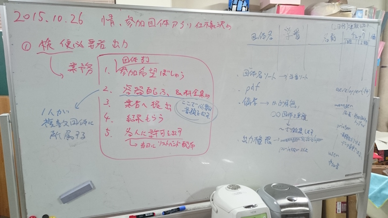
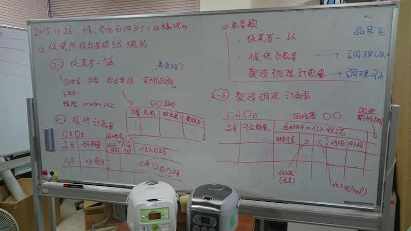
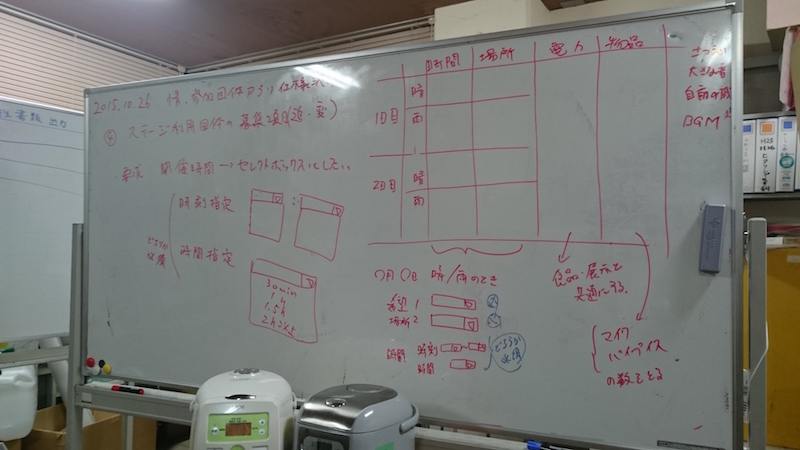

# 情報 参加団体アプリ仕様決め

## 1. 検便必要者 資料 出力

###  業務

1. 団体別参加希望募集
 - 1人が複数団体に所属する
2. 業者へ提出
3. 結果をもらう
4. 各人に許可を示す
 - 当日にリストバンド配布

###  出力項目

 * 団体名
 * 学番
 * 名前
 * 受け取りチェック欄2日分(空欄2つ)
 * 備考欄(重複の場合は, ○ 団体で徴収と明記する)

出力項目イメージ

| 団体名     | 学番                       | 名前                 | 受取1日目      | 受取2日目        | 備考欄           |
| :--        | :--                        | :--                  | :--            | :--              | :--              |
| hoge       | s1\*\*\*\*\*               | tarou                | \*             |                  | hugaにて徴収済み |

###  出力形式

  pdf形式
  団体ソートで全提出者 一覧表示

###  出力権限
  データ編集はできず, データ出力を持つ権限を作る

| 権限名     | できること                 |
| :--        | :--                        |
| developper | 神                         |
| manager    | crud(参加団体のみ), print  |
| printer    | read, print                |
| user       | read, update               |

## 2. 保健所提出書類作成機能

### 必要書類

 * 従業員一覧
 * 提供計画書 (品目を調理しない)
 * 製造調理計画書 (品目を調理する)

| 品目を調理 | 必要書類                   |
| :--        | :--                        |
| する       | 従業員一覧, 提供計画書     |
| しない     | 従業員一覧, 製造調理計画書 |

### 従業者一覧 出力項目

権限: printer以上

 * 団体名
 * 学番
 * 担当業務
 * 出店(予定)日

イメージ

| 団体名     |                            |                      |                |
| :--        | :--                        | :--                  | :--            |
| 学番       | 名前                       | 担当業務             | 出店日         |
| 項目       |                            |                      |                |

###  提供計画書
| ○ 月○ 日   |                            |                      |                |                  |
| :--        | :--                        | :--                  | :--            | :--              |
| 品目       | 予定数量                   | 仕入先店名           | 仕入先tel      | 仕入日時         |
| AA         | \*\*食分                   | ~店                  | 0258-0000-0000 | ○ 月○ 日         |

### 製造調理計画書
| ○ 月○ 日   |                            | 原材                 | 量             | の               | 仕入             | 状況     |              |
| :--        | :--                        | :--                  | :--            | :--              | :--              | :--      | :--          |
| 品目       | 予定数量                   | 材料名               | 仕入先店名     | 仕入先tel        | 仕入日           | 仕入時   | 調理開始時刻 |
| AAAAAA     | \*\*食分                   | ○ ○                  | ~店            | 0258-0000-0000   | ○ 月○ 日         | 〜時     | 〜時         |

## 3. 電力・物品一覧 確認書類出力

### 各団体の確認用書類 pdf

** 必要項目 **
 * ○ ○ 団体名
 * 希望場所
 * 電力申請一覧
  - 品目
  - メーカ
  - 型番
  - 消費電力
 * 物品申請一覧
  - 品目
  - 数量

** 電力申請一覧 イメージ **

| 品目       | メーカ                     | 型番                 | 消費電力       |
| :--        | :--                        | :--                  | :--            |
|            |                            |                      |                |

** 物品申請一覧 イメージ **

| 品目       | 数量                       |
| :--        | :--                        |
|            |                            |

### 電力担当向け一覧 (csv)
権限: printer以上

| カテゴリ   | 整理番号                   | 団体名               | 希望場所       | 品目             | メーカ           | 型番     | 消費電力     | 数量 |
| :--        | :--                        | :--                  | :--            | :--              | :--              | :--      | :--          | :--  |
|            |                            |                      |                |                  |                  |          |              |      |

電力担当が各団体の場所を決めたら, ** "このフォーマットのまま" ** 受け取る.

## 4. ステージ利用団体の募集項目追加・変更

### 開催時間入力について
従来 : 自由記述
問題 : 個人によって記述に揺らぎがある

総務からの要求 : 記述の揺らぎをなくしたい -> セレクトボックスにしたい
団体からの要求 : 2タイプの団体がある

* 使用時刻を厳密に指定したい団体(鶴亀etc)
* ステージを使用する時間(30min~2h)を指定したい団体

** どちらか必須 **

セレクトボックスで選択させる

| 指定方法   | 入力方法                   |
| :--        | :--                        |
| "時刻"指定 | \*\*:\*\*  ~ \*\*:\*\*     |
| "時間"指定 | 30min~2hまで30min区切り    |

### 晴天時, 雨天時の時間, 場所, 電力, 物品について
従来 : 晴天時, 雨天時の1,2日目はすべて同じ入力フォームから入力していた.

問題: 晴天/雨天時と1/2日目の組み合わせで4パターンのデータが必要となる.
パターンごとにステージ利用時間, 場所がそれぞれで別のものになる.
従来はこれが混在していた.

対策: 前もって4パターンそれぞれで時間/場所の選択項目を決め, 選択させた方が良い.

| 日程       | 天気                       | 時間                 | 場所           | 電力             | 物品             | 出演内容 |
| :--        | :--                        | :--                  | :--            | :--              | :--              | :--      |
| 1日目      | 晴                         | \*                   | \*             | 既存電力テーブル | 物品既存テーブル |          |
| 1日目      | 雨                         | \*                   | \*             |                  |                  |          |
| 2日目      | 晴                         | \*                   | \*             |                  |                  |          |
| 2日目      | 雨                         | \*                   | \*             |                  |                  |          |

** 電力 **
食品・展示団体と共通にする

** 物品 **
食品・展示団体と共通にする
マイク, パイプ椅子
の数をとる

### ステージ利用で共通の項目について
別でテーブルを用意する

| 撮影許可   | 大きな音                   | 自前の音響機材の使用 | BGM            |
| :--        | :--                        | :--                  | :--            |
|            |                            |                      |                |

### 総務へ要求項目

** 上記項目についてどの一覧が欲しいか.  **
* 希望時間
* 希望場所
* 希望電力
* 希望物品

ex) ステージ団体のみ

Answer :
ステージのスケジュールを決める際, 希望時間と場所, 出演内容があればOK.

** 物品, 電力について **

物品は, 食品団体等の表にまとめる?
電力も, 食品団体等の表にまとめる?

Answer. どっちもまとめてOK!!

** 何順で並び替えれば良い? **

場所?  時間?  両方?
Answer: 場所順で並んでいてほしい!!!

