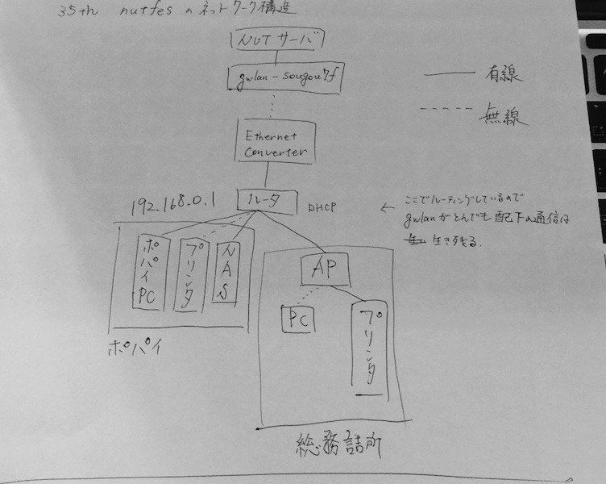

## 当日のセットアップ
### 用意するもの

* プリンタ2台(EPSON PX-M5041F, EPSON LP-S5300)
* デスクトップPC
* ルータ2台(NEC aterm WR8750N, NEC airport wn-g300r(私物))
* NAS(LS-QVL/1D Series)
* Ethernet Converter()

全部持ってきて電源を入れる.

### ポパイ内のLAN構築
WR8750Nを **ローカルルータモード** ,  **DHCP有効** , **無線AP有効** で起動(ここ重要).  
WR8750Nをルータモード, なおかつ, DHCPで起動しないと自動でルーティングしてくれないため注意.  
WR8750Nの設定画面はブラウザのアドレスバーに``192.168.0.1(デフォルト値)``を入力してアクセスできる.  
詳細については, githubの``NUTFes/nutfes_docs/setup_WR8750N.md`` を見る.  

無線AP側のssid, pwは適宜設定する.

LAN側有線ポートにPC,NASを有線接続.   
次にプリンタ(PX-M5041F)を無線接続.  
おそらくは自動的にLANに繋がるが, できない場合は適宜設定する.  
PC側のセットアップについては  
``NUTFes/nutfes_docs/setup_driver_PXM5041F.md``  
を見る.
これでPC, NAS,プリンタはLAN配下に入る.  

ちゃんとルータに接続されているかルーティングテーブルを確認する.
以下をターミナルに入力.
```
ルーティングテーブルの表示
# windowsの場合
$ arp -a    

# macの場合
$ netstat -rn
```
MACアドレスを確認して端末接続を確認する.
githubの``NUTFes/nutfes_docs/setup_WL300NE-AG.md`` を見る.  

### 外部ネットワークと接続
Ethernet Converterのセットアップについては,  
githubの``NUTFes/nutfes_docs/setup_WL300NE-AG.md`` を見る.  
設定画面のIPアドレスは``192.168.0.240(デフォルト値)``.

Ethernet ConverterのLANポートからルータのWANに有線接続.  
これでルータ上のネットワークから外部ネットワークに接続できる.  

### 本部のWi-Fiとプリンタの接続
本部用にアクセスポイントを作る(AP).
WR8750NのLANポートから有線ケーブルを伸ばし,   
別のルータ(NEC airport WN-G300R )のWANに繋ぐ.
NEC airport WN-G300Rは **APモード** で起動する.  
こちらも無線AP側のssid, pwは適宜設定する.   
詳細については, githubの``NUTFes/nutfes_docs/setup_WN-G300R.md`` を見る.  
  
NEC airport WN-G300RのLANポートからプリンタ(LP-S5300)に有線接続する.  
詳細は``NUTFes/nutfes_docs/setup_driver_LPS5300.md`` を見る.

### 配線図の概略

